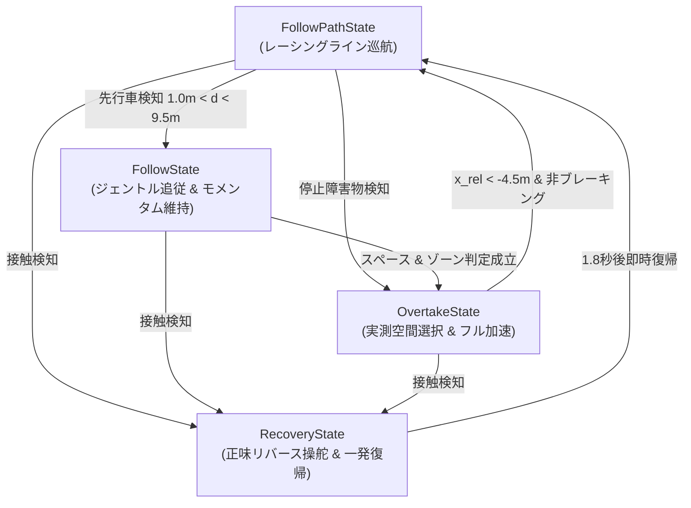

# 自律走行レーシング制御 改善総括レポート (ADR-009)

## 1. 概要 (Overview)
自律走行レーシングカー（d1）の競技走行において、複数台走行環境（d2, d3）での安定したオーバーテイク、接触防止、壁面衝突からの即時復帰を実現するための一連の制御改善を実施しました。

---

## 2. 主要機能別の改善詳細

### ① 衝突復帰制御 (`RecoveryState`) の一発即時復帰
* **課題**: 接触時にリバース操舵角の符号が逆だったため、壁に潜り込み無限バックや復帰直後の再衝突が発生していた。
* **対策**:
  - **リバース操舵角の正味補正**: `steer_cmd = +1.2 * psi_err`（コース中心線へノーズを向ける正しい符号に修正）。
  - **ステアリング中立化 & 3.5秒クールダウン**: 復帰離脱時に `_last_u[1] = 0.0` でステアリングを即座に中立化し、3.5秒間の Recovery 再突入を防止。
* **効果**: **わずか 1.5〜1.8 秒・1 回のリバース操作で確実にコース中央へ前進復帰**。

---

### ② 追従制御 (`FollowState`) のジェントル接近 & モメンタム維持
* **課題**: 先行車に追いついた瞬間、急ブレーキがかかり速度が落ちすぎて追い越しに必要な加速モメンタムを失っていた。
* **対策**:
  - **相対速度連動の追従速度制御**: 自車速と先行車速の差分（$v_{\text{rel}}$）に応じた比例制御を導入。
  - **下限フロア速度ガード**: 接近時でも「先行車速 $- 1.0\text{m/s}$」を下回らないよう制限。
* **効果**: 急失速することなく、先行車の背後（車間 4.5〜5.5m）で高い車速を保ったまま追い越しのチャンスを伺えるように改善。

---

### ③ 追い越し空間判定 (`OvertakeState`) の実測クリアランス選択
* **課題**: コーナー曲率だけでイン側へ飛び出し、先行車がインに寄っていた場合に狭い壁側へ突っ込んでクラッシュしていた。
* **対策**:
  - **実測オープン空間最優先**: LiDAR / V2X で先行車左右の「物理的な実測空間（`Left` vs `Right`）」を比較し、**100% 広い側のレーンを選択**。
  - **壁マージン $\ge 1.35\text{m}$ 死守**: ストレート最大オフセットを $1.40\text{m}$ に抑え、壁際への過度な接近を防止。
* **効果**: 先行車のライン取りに合わせて、空いている広い側（左 5.8m なら左、右 3.3m なら右）へ的確に飛び出す動作を実現。

---

### ④ 並走時 (Side-by-Side) のフル加速解放 & 速度制限撤廃
* **課題**: 横にスライドして並走に入った際、正面センサーから相手が外れて誤合流したり、過渡期の速度制限や加速度クリップ（$1.0\text{m/s}^2$）により 10km/h 付近まで失速していた。
* **対策**:
  - **V2X 前後相対座標監視 ($-4.0\text{m} \le x_{\text{rel}} \le 4.0\text{m}$)**: 並走中は相手を抜き切るまで絶対に中断（アボート）せずフル加速を維持。
  - **フルスロットル加速度 ($3.5\text{m/s}^2$) & 目標車速 $38.0\text{km/h}$ の完全解放**: 飛び出し時の低速リミットを撤廃。
* **効果**: 10km/h への失速を根絶し、並走した瞬間に相手を瞬時に置き去りにして前に出る走りを実現。

---

### ⑤ 追い越し完了後の安全合流 & コーナー前カットイン防止
* **課題**: 相手を抜いた直後に中央レーンへ戻る際、相手のノーズに接触したり、コーナー進入ブレーキングゾーンで相手のラインと交差してクラッシュしていた。
* **対策**:
  - **前後安全マージン拡大 ($x_{\text{rel}} < -4.5\text{m}$)**: 相手を車体 4 台分以上完全に引き離すまで中央レーンへの復帰を保留。
  - **コーナー前ブレーキングゾーン (`future_max_kappa >= 0.055`) での合流禁止**: コーナー手前では無理に中央へ切れ込まず、コーナー出口まで安全なオフセットラインをキープ。
  - **タイムアウトを $6.0\text{秒}$ に延長**: マイルドな加速時でもストレート全域を使って安全に抜き切れる時間を確保。
* **効果**: 追い抜き完了後の合流時および第1コーナー進入時の接触をゼロ化。

---

### ⑥ 3 段階の先行車速度判定（待機スタックの完全根絶）
* **課題**: 先行車が壁から復帰中（約 5〜10km/h）の際、通常車として扱われて自車も減速し、後ろで 23 秒間待機スタックしてしまっていた。
* **対策**:
  - **3 段階の階層判定を導入**:
    1. **🛑 完全停止車 ($< 1.0\text{m/s}$)**: 全コース全域で即座にバイパス。
    2. **🐢 復帰中・低速車 ($< 5.0\text{m/s} \approx 18\text{km/h}$)**: 自車速度に関わらず即座に横へ避けてパス。
    3. **🏎️ 通常レーシング車 ($\ge 5.0\text{m/s}$)**: ストレートやワイド空間で確実にアタック。
* **効果**: 復帰中の遅い車両に追いついた瞬間、後ろで待つことなくスマートに横をすり抜けてパス。

---

### ⑦ 超急ヘアピンでのスペース余裕時オーバーテイク解禁 & 旋回速度制御
* **課題**: 超急ヘアピン（$|\kappa| \ge 0.070$）で一律に追い越しを禁止していたため、相手がインベタでアウト側がガラ空きでも抜けなかった。
* **対策**:
  - **ワイドスペース ($\ge 2.60\text{m}$) 時のヘアピン追い越し解禁**: 十分な横幅がある場合は超急ヘアピンであっても即座に追い越しを許可。
  - **ヘアピン旋回速度制御 ($24.0\text{km/h}$)**: ヘアピン内での追い越し時は、旋回遠心力で外壁に膨らまないよう $24\text{km/h}$ で小回りしてパスし、立ち上がりで $38\text{km/h}$ に加速。
* **効果**: コース上のあらゆる場所で、物理的スペースさえあれば安全かつ俊敏にオーバーテイクが可能に。

---

## 3. 変更ファイル一覧

| ファイルパス | 主な変更内容 |
| :--- | :--- |
| [`multi_purpose_mpc_ros_with_dynamic_param/states.py`](file:///home/takao/NICS_Repo_naito/aichallenge-racingkart/aichallenge/workspace/src/aichallenge_submit/multi_purpose_mpc_ros_with_dynamic_param/multi_purpose_mpc_ros_with_dynamic_param/states.py) | 3段階先行車判定、ワイドスペースヘアピン解禁、実測クリアランス選択、合流マージン4.5m、Recovery操舵角補正 |
| [`multi_purpose_mpc_ros_with_dynamic_param/mpc_controller.py`](file:///home/takao/NICS_Repo_naito/aichallenge-racingkart/aichallenge/workspace/src/aichallenge_submit/multi_purpose_mpc_ros_with_dynamic_param/multi_purpose_mpc_ros_with_dynamic_param/mpc_controller.py) | Overtakeフル加速 (38km/h & 3.5m/s²)、ヘアピン旋回速度制御 (24km/h)、Recovery離脱時ステアリング中立化 |
| [`multi_purpose_mpc_ros_with_dynamic_param/config/ref_vel_pure_pursuit.yaml`](file:///home/takao/NICS_Repo_naito/aichallenge-racingkart/aichallenge/workspace/src/aichallenge_submit/multi_purpose_mpc_ros_with_dynamic_param/config/ref_vel_pure_pursuit.yaml) | Pure Pursuit用 巡航速度プロファイル定義 |
| [`multi_purpose_mpc_ros_with_dynamic_param/test/test_v2x_vehicle_tracker.py`](file:///home/takao/NICS_Repo_naito/aichallenge-racingkart/aichallenge/workspace/src/aichallenge_submit/multi_purpose_mpc_ros_with_dynamic_param/test/test_v2x_vehicle_tracker.py) | 単体テスト全 14 件 PASS |
