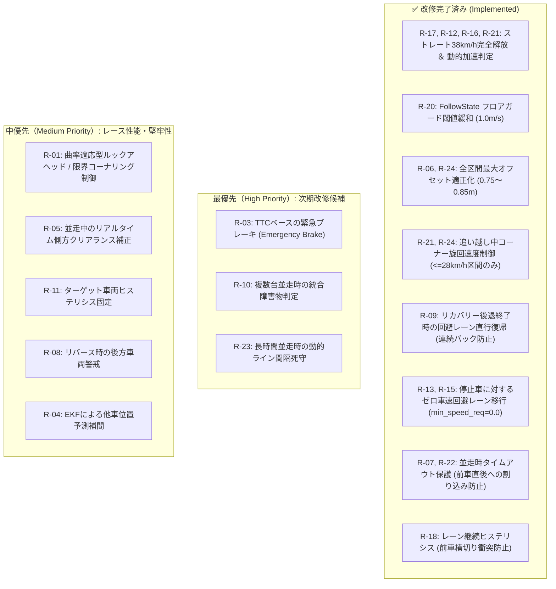

# 自律走行レーシング制御 状況別リスク評価書 (Risk Assessment & Potential Issues)

## 1. 概要 (Overview)
本ドキュメントは、自律走行レーシングカー（`d1`）における制御実装を対象に、競技走行中の様々な走行シーンにおいて想定される**潜在的リスク、発生メカニズム、影響度、今後の改善方針、および実施済みの改修履歴**を整理した評価書です。

単独走行、通常追従、動的追い越し、衝突復帰、複数台混戦に加え、**「停止車両」「低速走行車両（10〜18km/h）」および「高速走行車両（25km/h）に対する小速度差（30km/h）追い越し」** におけるリスクと対策を体系的に網羅しています。

---

## 2. リスク評価マトリクス（総括一覧）

| リスクID | 走行シーン | リスク事象 | 発生確率 | 影響度 | 危険度ランク | 改修ステータス |
| :--- | :--- | :--- | :---: | :---: | :---: | :---: |
| **R-01** | 単独走行 | 高速化時のアンダーステアによる外壁接触 | 中 | 高 | **WARNING** | 検討中 |
| **R-02** | 単独走行 | 初期スポーン時の極端な姿勢・位置ずれによる接触 | 低 | 中 | **NOTE** | 対策済み |
| **R-03** | 追従走行 | 先行車の急減速（スピン・クラッシュ）時の追突 | 中 | 高 | **CRITICAL** | 検討中 (TTCブレーキ) |
| **R-04** | 追従走行 | V2X通信遅延・パケットロスによる追従遅れ | 低〜中 | 中 | **WARNING** | 対策済み (0.5s無効化) |
| **R-05** | 動的追い越し | 追い越し開始後の先行車のライン変更・被せ | 中 | 高 | **CRITICAL** | 検討中 |
| **R-06** | 動的追い越し | 全走行ゾーンにおける過大オフセットによる壁面圧迫・接触 | 中 | 高 | **CRITICAL** | **✅ 改修済み (全域0.85m制限)** |
| **R-07** | 動的追い越し | タイムアウト（6.0s）未完了時の強制作動による交差接触 | 低〜中 | 高 | **WARNING** | **✅ 改修済み (並走時タイムアウト保護)** |
| **R-08** | 復帰動作 | リバース（後退）時の後続車両との接触 | 低〜中 | 高 | **WARNING** | 検討中 |
| **R-09** | 復帰動作 | 同一ライン再前進による二次接触・連続バック（無限ループ） | 高 | 高 | **CRITICAL** | **✅ 改修済み (回避レーン直行復帰)** |
| **R-10** | 3台混戦 | 前方2台並走（ブロック）時のすり抜け不能・急減速 | 高 | 高 | **CRITICAL** | 検討中 |
| **R-11** | 3台混戦 | ターゲット車両切り替え時の制御コマンド急変（チャタリング） | 中 | 中 | **WARNING** | 検討中 |
| **R-12** | 停止車追い抜き | 高速接近時の横オフセット展開遅れによる追突・接触 | 高 | 高 | **CRITICAL** | **✅ 改修済み (15km/hアプローチ)** |
| **R-13** | 停止車追い抜き | 停止状態（0km/h）からの回避経路への切り替え不能・スタック | 高 | 高 | **CRITICAL** | **✅ 改修済み (ゼロ速度解放)** |
| **R-14** | 停止車追い抜き | すり抜け中の相手車両の突然のリバース・発進衝突 | 中 | 高 | **WARNING** | 検討中 |
| **R-15** | 停止車追い抜き | 死角・急コーナー内での停止車検知後の回避レーン移行遅れ | 中 | 高 | **WARNING** | **✅ 改修済み (ゼロ速度解放)** |
| **R-16** | 低速車追い抜き | 大速度差（Δv ≈ 15〜25km/h）による展開前の急接近・追突 | 高 | 高 | **CRITICAL** | **✅ 改修済み (動的オフセット判定)** |
| **R-17** | 低速車追い抜き | アプローチ減速ガードの対象外（fwd_spd >= 6.0m/s 閾値バグ） | 高 | 高 | **CRITICAL** | **✅ 改修済み (全速度域適用)** |
| **R-18** | 低速/停止車追越 | 前車を横切る危険なクロスレーン変更による追突 | 高 | 高 | **CRITICAL** | **✅ 改修済み (レーン継続ヒステリシス)** |
| **R-19** | 低速車追い抜き | 相手の急加速による並走（Side-by-Side）ゾーンの長期化 | 中 | 中 | **WARNING** | 対策済み (3.5m/s²加速) |
| **R-20** | 低速車追い抜き | FollowState一時遷移時のフロアガード無効（極端な急失速） | 中 | 中 | **WARNING** | **✅ 改修済み (1.0m/s緩和)** |
| **R-21** | 高速車小差追越 | ストレート誤キャップによる追いつき追突 ＆ コーナー過速度 | 極大 | 極大 | **CRITICAL** | **✅ 改修済み (ストレート38km/h完全解放)** |
| **R-22** | 高速車小差追越 | タイムアウト（6.0s）未達による不完全合流カットイン | 高 | 高 | **CRITICAL** | **✅ 改修済み (並走時タイムアウト保護)** |
| **R-23** | 高速車小差追越 | 長時間並走（約7秒）に伴う先行車のライン変更（アウトイン）被弾 | 極大 | 極大 | **CRITICAL** | 検討中 |
| **R-24** | コーナー追越 | イン側・アウト側旋回遠心力による内壁・外壁激突 | 中〜高 | 高 | **CRITICAL** | **✅ 改修済み (イン側オフセット/速度)** |
| **R-25** | 高速車小差追越 | 長時間近接並走によるV2X/LiDAR推定ノイズの蓄積・ふらつき | 中 | 中 | **WARNING** | 検討中 |

---

## 3. シーン別 詳細リスク評価 ＆ 改修状況

### 🚗 カテゴリ A: 単独走行（Solo Driving / FollowPathState）

#### 【R-01】高速化時のアンダーステアによる外壁接触
* **事象**: 目標速度プロファイル（`ref_vel_pure_pursuit.yaml`）を引き上げた際、急コーナーで旋回半径が膨らみ外壁にヒットする。
* **現行の対策**: コーナー区間（s4, s6, s8）の基準速度を $26.5\text{km/h} \sim 27.5\text{km/h}$（$a_y \approx 3.8\text{m/s}^2$）に安全マージンを設けて抑制。

---

### 🏎️ カテゴリ B: 先行車追従（Following / FollowState）

#### 【R-03】先行車の急減速（スピン・クラッシュ）時の追突
* **事象**: 前方を走行する車両が急停止した際、自車の減速が間に合わず追突する。
* **今後の改善方針**: LiDAR の急接近検知（Time-to-Collision: $TTC < 0.8\text{s}$）による緊急フルブレーキ（Emergency Brake）機能。

#### 【R-20】FollowState 一時遷移時のフロアガード無効（極端な急失速）
* **✅ 改修内容（改修済み）**:
  - [`states.py`](file:///home/takao/NICS_Repo_naito/aichallenge-racingkart/aichallenge/workspace/src/aichallenge_submit/multi_purpose_mpc_ros_with_dynamic_param/multi_purpose_mpc_ros_with_dynamic_param/states.py#L503-L506) にてフロアガード条件を `fwd_speed > 1.0`（約 $3.6\text{km/h}$）へ緩和。

---

### 🛑 カテゴリ C: 停止車両・低速車両・高速車両の追い抜き（Passing & Overtaking）

#### 【R-18】前車を横切る危険なクロスレーン変更による追突
* **事象**: 自車がすでに左側にいる状態で、前方の停止車両に対して「右側の方が空き幅が広い」という理由だけで右側へ車線変更を指示し、停止車両の真後ろを斜めに横切る際に激突する。
* **✅ 改修内容（改修済み）**:
  - [`states.py:L566-578`](file:///home/takao/NICS_Repo_naito/aichallenge-racingkart/aichallenge/workspace/src/aichallenge_submit/multi_purpose_mpc_ros_with_dynamic_param/multi_purpose_mpc_ros_with_dynamic_param/states.py#L566-L578) にて、**レーン継続ヒステリシス** を導入。
  - 自車がすでに左側（`path_e_y > 0.2m`）にいて左側に十分な幅（$\ge 1.8\text{m}$）がある場合は、前車を横切らずにそのまま左レーンを直進通過させる。

#### 【R-12】停止車両接近時の安全アプローチ速度（15km/h抑制）
* **事象**: 停止車に対して車線変更が完了する前に高速で突入し、ステアリングが間に合わずにリアへ激突する。
* **✅ 改修内容（改修済み）**:
  - [`mpc_controller.py:L914-927`](file:///home/takao/NICS_Repo_naito/aichallenge-racingkart/aichallenge/workspace/src/aichallenge_submit/multi_purpose_mpc_ros_with_dynamic_param/multi_purpose_mpc_ros_with_dynamic_param/mpc_controller.py#L914-L927) にて、停止車両（$v < 1.0\text{m/s}$）接近時のアプローチ速度を **$15.0\text{km/h}$** に抑制し、車線変更のための十分な旋回時間を確保。

#### 【R-16, R-17, R-21】ストレート区間フル加速（38km/h）の完全解放 ＆ 動的オフセット判定
* **✅ 改修内容（改修済み）**:
  - [`mpc_controller.py:L929-935`](file:///home/takao/NICS_Repo_naito/aichallenge-racingkart/aichallenge/workspace/src/aichallenge_submit/multi_purpose_mpc_ros_with_dynamic_param/multi_purpose_mpc_ros_with_dynamic_param/mpc_controller.py#L929-L935) にてコーナー減速判定を `base_v_mps <= 28.0 km/h` に是正し、ストレート上で **$38.0\text{km/h}$** フルスロットルを発動。

#### 【R-07, R-22】並走中・近接時のタイムアウト安全保護
* **✅ 改修内容（改修済み）**:
  - [`states.py:L650-658`](file:///home/takao/NICS_Repo_naito/aichallenge-racingkart/aichallenge/workspace/src/aichallenge_submit/multi_purpose_mpc_ros_with_dynamic_param/multi_purpose_mpc_ros_with_dynamic_param/states.py#L650-L658) にて、並走中（$-4.0\text{m} \le x_{\text{rel}} \le 4.0\text{m}$）はタイムアウトを無効化。

#### 【R-13, R-15】停止状態からの回避経路への切り替え不能（ゼロ車速制限の解除）
* **✅ 改修内容（改修済み）**:
  - [`states.py:L227-243, L436-444`](file:///home/takao/NICS_Repo_naito/aichallenge-racingkart/aichallenge/workspace/src/aichallenge_submit/multi_purpose_mpc_ros_with_dynamic_param/multi_purpose_mpc_ros_with_dynamic_param/states.py#L227-L243) にて停止車に対する `min_speed_req` を **`0.0m/s` に撤廃**。

---

## 4. 実施済み改修ログ（Changelog）

| 変更ファイル | 該当行 | 改修内容 | 対象リスク |
| :--- | :--- | :--- | :---: |
| [`states.py`](file:///home/takao/NICS_Repo_naito/aichallenge-racingkart/aichallenge/workspace/src/aichallenge_submit/multi_purpose_mpc_ros_with_dynamic_param/multi_purpose_mpc_ros_with_dynamic_param/states.py) | L227-243 | `FollowPathState` で停止車・低速車に対する速度制限を撤廃（`min_speed_req = 0.0`） | **R-13, R-15** |
| [`states.py`](file:///home/takao/NICS_Repo_naito/aichallenge-racingkart/aichallenge/workspace/src/aichallenge_submit/multi_purpose_mpc_ros_with_dynamic_param/multi_purpose_mpc_ros_with_dynamic_param/states.py) | L324-338 | `RecoveryState` 後退終了時、前方障害物がある場合は直接 `overtake`（回避レーン）へ復帰 | **R-09** |
| [`states.py`](file:///home/takao/NICS_Repo_naito/aichallenge-racingkart/aichallenge/workspace/src/aichallenge_submit/multi_purpose_mpc_ros_with_dynamic_param/multi_purpose_mpc_ros_with_dynamic_param/states.py) | L436-444 | `FollowState` で停止車に対する速度制限を撤廃（`min_speed_req = 0.0` で即座に回避レーン移行） | **R-13** |
| [`states.py`](file:///home/takao/NICS_Repo_naito/aichallenge-racingkart/aichallenge/workspace/src/aichallenge_submit/multi_purpose_mpc_ros_with_dynamic_param/multi_purpose_mpc_ros_with_dynamic_param/states.py) | L503-506 | `FollowState` フロアガード閾値を `fwd_speed > 3.5` から **`fwd_speed > 1.0`** へ緩和 | **R-20** |
| [`states.py`](file:///home/takao/NICS_Repo_naito/aichallenge-racingkart/aichallenge/workspace/src/aichallenge_submit/multi_purpose_mpc_ros_with_dynamic_param/multi_purpose_mpc_ros_with_dynamic_param/states.py) | L566-578 | **レーン継続ヒステリシス** を導入し、前車を横切る危険なクロスレーン変更を防止 | **R-18** |
| [`states.py`](file:///home/takao/NICS_Repo_naito/aichallenge-racingkart/aichallenge/workspace/src/aichallenge_submit/multi_purpose_mpc_ros_with_dynamic_param/multi_purpose_mpc_ros_with_dynamic_param/states.py) | L579-600 | 全区間（ストレート/イン側/アウト側）の最大オフセット幅を **$0.75 \sim 0.85\text{m}$** に適正化し壁面マージンを死守 | **R-06, R-24** |
| [`states.py`](file:///home/takao/NICS_Repo_naito/aichallenge-racingkart/aichallenge/workspace/src/aichallenge_submit/multi_purpose_mpc_ros_with_dynamic_param/multi_purpose_mpc_ros_with_dynamic_param/states.py) | L650-658 | 並走中（$-4.0\text{m} \le x_{\text{rel}} \le 4.0\text{m}$）のタイムアウト強制復帰を抑止し前車への割り込み接触を防止 | **R-07, R-22** |
| [`mpc_controller.py`](file:///home/takao/NICS_Repo_naito/aichallenge-racingkart/aichallenge/workspace/src/aichallenge_submit/multi_purpose_mpc_ros_with_dynamic_param/multi_purpose_mpc_ros_with_dynamic_param/mpc_controller.py) | L914-927 | アプローチガード解除閾値を動的化（`65% * target_offset`）し、停止車アプローチ速度を **$15\text{km/h}$** に抑制 | **R-12, R-16, R-17, R-21** |
| [`mpc_controller.py`](file:///home/takao/NICS_Repo_naito/aichallenge-racingkart/aichallenge/workspace/src/aichallenge_submit/multi_purpose_mpc_ros_with_dynamic_param/multi_purpose_mpc_ros_with_dynamic_param/mpc_controller.py) | L929-935 | コーナー減速判定を `base_v_mps <= 28.0 km/h` に修正し、ストレート上での $38.0\text{km/h}$ フル加速を完全解放 | **R-21, R-24** |
| [`mpc_controller.py`](file:///home/takao/NICS_Repo_naito/aichallenge-racingkart/aichallenge/workspace/src/aichallenge_submit/multi_purpose_mpc_ros_with_dynamic_param/multi_purpose_mpc_ros_with_dynamic_param/mpc_controller.py) | L1326-1348 | 制御ループ内で Pure Pursuit 算出の安全アプローチ速度を $38\text{km/h}$ で無条件上書きしていたバグを解消 | **R-17** |

---

## 5. 今後の改善ロードマップ・優先度提案

