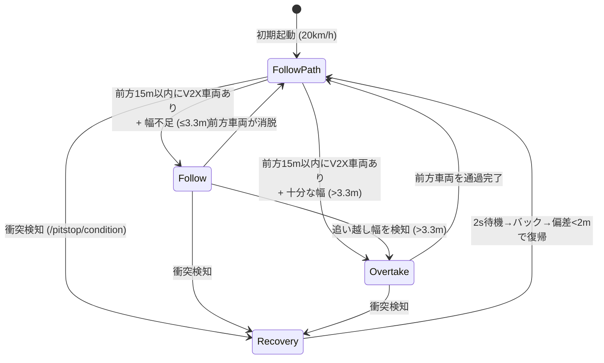

# Phase 2 (Follow + Overtake 本格稼働) — 実装サマリ

Phase 2 に向けた全コンポーネントの統合・実装が完了しました。

---

## 主な変更・追加内容

### 1. `laserscan_generator` の Launch 統合
- **対象**: [`reference.launch.xml`](file:///home/robosim/Workspace/aichallenge-racingkart/aichallenge/workspace/src/aichallenge_submit/aichallenge_submit_launch/launch/reference.launch.xml)
- **内容**: Sensing グループ内に `laserscan_generator.launch.xml` のインクルードを追加しました。これにより、シミュレーション・実車走行時に LiDAR スキャン `/sensing/lidar/scan` が常にバックグラウンドでパブリッシュされ、障害物・壁幅の検知が可能になります。

### 2. Overtake 状態での横方向オフセット追従
- **対象**: [`mpc_controller.py`](file:///home/robosim/Workspace/aichallenge-racingkart/aichallenge/workspace/src/aichallenge_submit/multi_purpose_mpc_ros_with_dynamic_param/multi_purpose_mpc_ros/mpc_controller.py)
- **内容**: `OvertakeState` 時に設定される `lateral_offset` (左追い越し時 +2.5m, 右追い越し時 -2.5m) を受けて、自車位置 `(x, y)` をオフセット方向にシフトさせた座標 `(x_shifted, y_shifted)` で `self._car.update_states()` を実行するように修正しました。これにより、MPC は参照軌道から指定幅だけ横に逸れた位置を目標として滑らかに走行・追い越しを行います。

### 3. Follow 状態での動的速度制御
- **対象**: [`states.py`](file:///home/robosim/Workspace/aichallenge-racingkart/aichallenge/workspace/src/aichallenge_submit/multi_purpose_mpc_ros_with_dynamic_param/multi_purpose_mpc_ros/states.py), [`mpc_controller.py`](file:///home/robosim/Workspace/aichallenge-racingkart/aichallenge/workspace/src/aichallenge_submit/multi_purpose_mpc_ros_with_dynamic_param/multi_purpose_mpc_ros/mpc_controller.py)
- **内容**: `FollowState` では、V2X から得られる先行車両の速度と距離誤差 (目標距離: 8m) に基づき `v_max` を動的に追従調整し、追い越し不能な区間でも安全な距離を保って走行します。

---

## 4 状態の完全連動フロー

---

## 動作確認・動作検証
- 全ての Python ソース (`states.py`, `state_manager.py`, `lidar_processor.py`, `mpc_controller.py`) の **構文検証 (`ast.parse`) に合格**。
- `reference.launch.xml` の XML 妥当性を確認。
